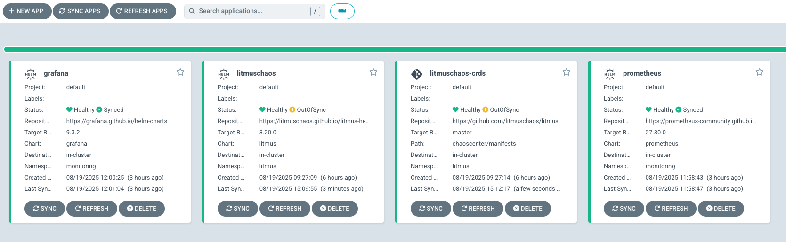

# LitmusChaos Demo on Azure Kubernetes Service

A comprehensive demonstration of chaos engineering using LitmusChaos on AKS with Kubernetes 1.33, featuring full observability through Prometheus and Grafana, managed via GitOps with ArgoCD.

## Repository Structure

| Directory                        | Description                                                  |
| -------------------------------- | ------------------------------------------------------------ |
| `infrastructure/`                | OpenTofu/Terraform configurations for AKS cluster and ArgoCD |
| `litmuschaos/argocd/`            | ArgoCD applications for LitmusChaos deployment               |
| `monitoring/argocd/`             | ArgoCD applications for Prometheus and Grafana               |
| `monitoring/dashboards/`         | Grafana dashboard configurations                             |
| `monitoring/servicemonitors/`    | ServiceMonitor configs (requires Prometheus Operator)        |
| `application/argocd/`            | ArgoCD application for demo app                              |
| `application/manifests/`         | Demo application Kubernetes manifests                        |
| `application/chaos-experiments/` | Chaos experiment definitions (numbered 00-14)                |

## Architecture Overview

```
Azure Subscription
└── Resource Group: litmuschaos-demo-rg
    └── AKS Cluster: litmuschaos-demo-aks (K8s 1.33)
        ├── System Pool (2-5 nodes)
        ├── Workload Pool (2-5 nodes)
        └── Namespaces:
            ├── argocd (Deployed via Terraform)
            ├── litmus (LitmusChaos)
            ├── monitoring (Prometheus & Grafana)
            └── demo-app (Sample application)
```

## Step 1: Infrastructure Setup with OpenTofu

### 1.1 Azure Authentication

```bash
az login
az account set --subscription <your-subscription-id>
```

### 1.2 Initialize and Deploy Infrastructure

```bash
cd infrastructure

./scripts/setup-backend.sh

tofu init
tofu plan
tofu apply
```

This will create:

- AKS cluster with Kubernetes 1.33
- Azure CNI with Cilium network policy
- Container Registry
- Log Analytics Workspace
- ArgoCD via Helm (v8.3.0)

### 1.3 Configure kubectl

```bash
az aks get-credentials --resource-group litmuschaos-demo-rg --name litmuschaos-demo-aks
kubectl get nodes
```

Expected nodes:

| Node Pool | VM Size         | Count             | Purpose               |
| --------- | --------------- | ----------------- | --------------------- |
| system    | Standard_D2s_v5 | 2-5 (autoscaling) | System workloads      |
| workload  | Standard_D4s_v5 | 2-5 (autoscaling) | Application workloads |

## Step 2: Access ArgoCD (Already Installed)

ArgoCD is deployed automatically by Terraform. Access it:

```bash
# Get initial admin password
kubectl -n argocd get secret argocd-initial-admin-secret -o jsonpath="{.data.password}" | base64 -d

# Port forward ArgoCD server
kubectl port-forward svc/argocd-server -n argocd 8080:443
```

Access ArgoCD at: https://localhost:8080

- Username: admin
- Password: (from command above)

## Step 3: Deploy Core Components via ArgoCD

### 3.1 Deploy LitmusChaos

```bash
# Deploy CRDs first
kubectl apply -f litmuschaos/argocd/chaos-crds.yaml

# Deploy LitmusChaos components
kubectl apply -f litmuschaos/argocd/litmuschaos.yaml
```

### 3.2 Fix Subscriber Configuration (if needed)

The subscriber may fail to connect. If so, fix the port:

```bash
kubectl patch configmap subscriber-config -n litmus --type='json' \
  -p='[{"op": "replace", "path": "/data/SERVER_ADDR", "value": "http://litmuschaos-server-service:9002/query"}]'

kubectl rollout restart deployment subscriber -n litmus
```

### 3.3 Deploy Monitoring Stack

```bash
# Deploy Prometheus with custom scrape configurations
kubectl apply -f monitoring/argocd/prometheus-app.yaml

# Optional: Apply additional scrape configs if Prometheus doesn't pick up all metrics
kubectl apply -f monitoring/prometheus-scrape-config.yaml

# Deploy Grafana
kubectl apply -f monitoring/argocd/grafana-app.yaml
```

### 3.4 Verify Deployments

| Component   | Namespace  | Verification Command             | Expected Pods                                                                 |
| ----------- | ---------- | -------------------------------- | ----------------------------------------------------------------------------- |
| ArgoCD      | argocd     | `kubectl get pods -n argocd`     | server, repo-server, redis, dex-server, applicationset-controller             |
| LitmusChaos | litmus     | `kubectl get pods -n litmus`     | chaos-operator-ce, server, auth-server, mongodb, frontend, subscriber         |
| Prometheus  | monitoring | `kubectl get pods -n monitoring` | prometheus-server, alertmanager, node-exporter (per node), kube-state-metrics |
| Grafana     | monitoring | `kubectl get pods -n monitoring` | grafana                                                                       |



## Step 4: Deploy Demo Application

### 4.1 Deploy via ArgoCD

```bash
kubectl apply -f application/argocd/demo-app.yaml
```

### 4.2 Verify Application

```bash
kubectl get all -n demo-app
```

Expected resources:

| Resource Type | Name           | Replicas | Purpose              |
| ------------- | -------------- | -------- | -------------------- |
| Deployment    | nginx-demo     | 3        | Demo web application |
| Service       | nginx-service  | 1        | ClusterIP service    |
| HPA           | nginx-demo-hpa | 3-10     | Auto-scaling         |

## Step 5: Install Chaos Experiments

### 5.1 Apply in Numbered Order

```bash
cd application/chaos-experiments

# Step 1: RBAC
kubectl apply -f 00-rbac.yaml

# Step 2: Experiment CRDs
kubectl apply -f 01-pod-delete-experiment.yaml
kubectl apply -f 02-cpu-hog-experiment.yaml
kubectl apply -f 03-memory-hog-experiment.yaml
kubectl apply -f 04-disk-fill-experiment.yaml
kubectl apply -f 05-network-latency-experiment.yaml
```

### 5.2 Verify Installation

```bash
kubectl get chaosexperiments -n demo-app
```

| Experiment          | File Prefix | Chaos Type      | Duration |
| ------------------- | ----------- | --------------- | -------- |
| pod-delete          | 01-         | Pod termination | 30s      |
| pod-cpu-hog         | 02-         | CPU stress      | 60s      |
| pod-memory-hog      | 03-         | Memory stress   | 60s      |
| disk-fill           | 04-         | Disk fill       | 60s      |
| pod-network-latency | 05-         | Network latency | 60s      |

## Step 6: Run Chaos Experiments

### 6.1 Execute Experiments (Numbered 10-14)

```bash
# Pod deletion chaos
kubectl apply -f 10-chaos-engine-pod-delete.yaml

# CPU stress chaos
kubectl apply -f 11-chaos-engine-cpu-hog.yaml

# Memory stress chaos
kubectl apply -f 12-chaos-engine-memory-hog.yaml

# Disk fill chaos
kubectl apply -f 13-chaos-engine-disk-fill.yaml

# Network latency chaos
kubectl apply -f 14-chaos-engine-network-latency.yaml
```

### 6.2 Monitor Experiments

| Command                                           | Purpose                 |
| ------------------------------------------------- | ----------------------- |
| `kubectl get chaosengine -n demo-app`             | List all chaos engines  |
| `kubectl describe chaosengine <name> -n demo-app` | Detailed engine status  |
| `kubectl get chaosresult -n demo-app`             | View experiment results |
| `kubectl get pods -n demo-app -w`                 | Watch pod changes       |

## Step 7: Access LitmusChaos Portal

```bash
kubectl port-forward svc/litmuschaos-frontend-service -n litmus 9091:9091
```

Access at: http://localhost:9091

| Field    | Value                 |
| -------- | --------------------- |
| URL      | http://localhost:9091 |
| Username | admin                 |
| Password | Litmus124!            |

## Step 8: Monitor with Grafana

### 8.1 Access Grafana

```bash
kubectl port-forward svc/grafana -n monitoring 3000:80
```

| Field       | Value                       |
| ----------- | --------------------------- |
| URL         | http://localhost:3000       |
| Username    | admin                       |
| Password    | admin                       |
| Data Source | Prometheus (pre-configured) |

### 8.2 Verify Prometheus Targets

```bash
kubectl port-forward svc/prometheus-server -n monitoring 9090:80
```

Access http://localhost:9090/targets to verify:

- demo-app-pods job is UP
- litmus-chaos-experiments job is UP
- kubernetes-nodes and kubernetes-pods are UP

### 8.3 Key Monitoring Queries in Explore

Navigate to Explore in Grafana and use these queries:

| Metric Type          | Query                                                                                                                                                                   | Description             |
| -------------------- | ----------------------------------------------------------------------------------------------------------------------------------------------------------------------- | ----------------------- |
| **Pod Availability** | `sum(kube_pod_status_ready{namespace="demo-app", condition="true", pod=~"nginx-demo.*"}) / sum(kube_pod_status_ready{namespace="demo-app", pod=~"nginx-demo.*"}) * 100` | Availability percentage |
| **CPU Usage**        | `rate(container_cpu_usage_seconds_total{namespace="demo-app", pod=~"nginx-demo.*"}[1m]) * 100`                                                                          | CPU percentage          |
| **Memory Usage**     | `container_memory_usage_bytes{namespace="demo-app", pod=~"nginx-demo.*"} / 1024 / 1024`                                                                                 | Memory in MB            |
| **Disk Usage**       | `(container_fs_usage_bytes{namespace="demo-app", pod=~"nginx-demo.*"} / container_fs_limit_bytes{namespace="demo-app", pod=~"nginx-demo.*"}) * 100`                     | Disk percentage         |
| **Pod Age**          | `(time() - kube_pod_created{namespace="demo-app", pod=~"nginx-demo.*"}) / 60`                                                                                           | Minutes since creation  |
| **Running Pods**     | `count(kube_pod_status_phase{namespace="demo-app", pod=~"nginx-demo.*", phase="Running"})`                                                                              | Active pod count        |
| **Active Chaos**     | `count(kube_pod_info{namespace="demo-app", pod=~".*chaos.*"})`                                                                                                          | Running experiments     |

## Step 9: Validate Chaos Impact

### 9.1 Expected Observations

| Experiment      | Visual Impact in Grafana    | Recovery Time |
| --------------- | --------------------------- | ------------- |
| Pod Delete      | Pod count drops, age resets | < 30 seconds  |
| CPU Hog         | CPU usage spikes to 100%    | Immediate     |
| Memory Hog      | Memory usage increases      | Immediate     |
| Disk Fill       | Disk usage spikes           | After cleanup |
| Network Latency | Response time increases     | Immediate     |

### 9.2 Verification Commands

```bash
# Check experiment status
kubectl get chaosengine -n demo-app
kubectl get chaosresult -n demo-app

# View pod status
kubectl get pods -n demo-app -o wide

# Check events
kubectl get events -n demo-app --sort-by='.lastTimestamp'
```

## Step 10: Cleanup

### 10.1 Remove Chaos Experiments

```bash
# Stop all running experiments
kubectl delete chaosengine --all -n demo-app

# Remove experiment definitions
kubectl delete chaosexperiment --all -n demo-app

# Remove RBAC
kubectl delete -f application/chaos-experiments/00-rbac.yaml
```

### 10.2 Remove Applications from ArgoCD

```bash
# Remove applications
kubectl delete application demo-app -n argocd
kubectl delete application litmuschaos -n argocd
kubectl delete application litmuschaos-crds -n argocd
kubectl delete application prometheus -n argocd
kubectl delete application grafana -n argocd
```

### 10.3 Destroy Infrastructure

```bash
cd infrastructure
tofu destroy -auto-approve
```

## Troubleshooting

### Common Issues

| Issue                         | Cause                       | Solution                                                     |
| ----------------------------- | --------------------------- | ------------------------------------------------------------ |
| Subscriber connection error   | Wrong port (9091 vs 9002)   | Apply patch command in Step 3.2                              |
| Prometheus sync fails         | Admission webhook conflicts | Use simple prometheus chart instead of kube-prometheus-stack |
| Chaos experiment not starting | RBAC missing                | Ensure 00-rbac.yaml is applied                               |
| Metrics not in Grafana        | Scrape config issue         | Check Prometheus targets at :9090/targets                    |
| ArgoCD app out of sync        | Manual changes              | Click "Sync" in ArgoCD UI                                    |
| Metrics missing for chaos/app | Scrape config not applied   | Apply monitoring/prometheus-scrape-config.yaml               |

### Useful Debug Commands

| Purpose                   | Command                                                  |
| ------------------------- | -------------------------------------------------------- |
| Check chaos operator logs | `kubectl logs -n litmus deployment/chaos-operator-ce`    |
| View experiment logs      | `kubectl logs -n demo-app -l name=<experiment>-runner`   |
| List all chaos resources  | `kubectl get chaosengine,chaosresult,chaosexperiment -A` |
| Check Prometheus targets  | `curl localhost:9090/api/v1/targets \| jq`               |
| ArgoCD app status         | `kubectl get application -n argocd`                      |

## Configuration Details

### Infrastructure Settings

| Setting            | Value                 | Location                      |
| ------------------ | --------------------- | ----------------------------- |
| Kubernetes Version | 1.33                  | `infrastructure/variables.tf` |
| Network Plugin     | Azure CNI with Cilium | `infrastructure/main.tf`      |
| Node OS            | Ubuntu 22.04          | Default                       |
| Storage Class      | managed-csi           | Azure Disk CSI                |

### Resource Requirements

| Component          | CPU Request | Memory Request | Storage |
| ------------------ | ----------- | -------------- | ------- |
| Prometheus Server  | 1000m       | 2Gi            | 50Gi    |
| Grafana            | 100m        | 128Mi          | 10Gi    |
| LitmusChaos Server | 250m        | 512Mi          | -       |
| MongoDB            | 500m        | 1Gi            | 20Gi    |
| Demo App (per pod) | 50m         | 64Mi           | -       |

## Important Configuration Files

| File | Purpose |
|------|---------|
| `monitoring/prometheus-scrape-config.yaml` | Additional Prometheus scrape configs for demo-app and chaos metrics |
| `monitoring/dashboards/chaos-dashboard.yaml` | Pre-configured Grafana dashboard for chaos experiments |
| `application/chaos-experiments/INSTALLATION_ORDER.md` | Detailed guide for experiment installation order |

## Additional Resources

| Resource                  | URL                                  |
| ------------------------- | ------------------------------------ |
| LitmusChaos Documentation | https://litmuschaos.io/docs          |
| ArgoCD Documentation      | https://argo-cd.readthedocs.io       |
| Prometheus Documentation  | https://prometheus.io/docs           |
| Grafana Documentation     | https://grafana.com/docs             |
| AKS Documentation         | https://docs.microsoft.com/azure/aks |
| OpenTofu Documentation    | https://opentofu.org/docs            |
